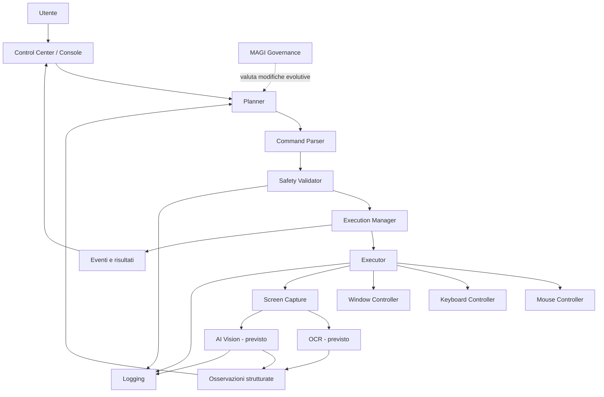

# Architettura di Pixel Bot

## Scopo

Questo documento descrive l'architettura corrente e quella prevista per l'MVP. La regola principale è separare osservazione, pianificazione, validazione ed esecuzione, evitando che un modello AI possa controllare direttamente il computer senza passare dai livelli di sicurezza.

## Diagramma

## Componenti

### Interface

Il Control Center Tkinter e la console raccolgono l'obiettivo, mostrano il piano, chiedono conferma, visualizzano stato, risultati ed errori e consentono l'arresto.

### Core

- `command_parser`: converte comandi supportati in azioni tipizzate;
- `planner`: ordina le azioni in un piano;
- `safety`: verifica nomi, parametri, applicazioni e limiti;
- `execution_manager`: gestisce stato, thread, stop ed eventi;
- `executor`: instrada ogni azione al controller corretto;
- `logger`: registra attività ed errori.

### Automation

Contiene i controller di mouse e tastiera. Questi moduli devono accettare solo operazioni già validate e non devono interpretare obiettivi in linguaggio naturale.

### Vision

- acquisizione dell'intero schermo, monitor o regione;
- gestione delle finestre;
- OCR previsto;
- AI Vision prevista;
- normalizzazione delle osservazioni in JSON.

### MAGI

MAGI governa decisioni di sviluppo e proposte evolutive. Non deve aggirare Safety, test, revisione umana o criteri dell'MVP.

## Flusso dei dati

### Comando deterministico

1. L'interfaccia riceve una stringa.
2. Il parser produce una lista di `Action`.
3. Il Planner crea `PlanStep` ordinati.
4. Safety valida ogni azione.
5. L'utente approva il piano.
6. Execution Manager invia ogni azione all'Executor.
7. I controller interagiscono con il desktop.
8. Eventi e risultati tornano all'interfaccia.
9. Il logger registra l'esecuzione.

### Flusso visivo previsto

1. Screen Capture crea un'immagine e i relativi metadati.
2. La privacy policy decide se l'immagine può restare locale o essere inviata a un provider.
3. OCR e/o AI Vision producono osservazioni strutturate.
4. Il Planner usa le osservazioni per proporre il passo successivo.
5. Safety valida il passo.
6. L'utente approva quando richiesto.
7. Dopo l'azione viene acquisita una nuova osservazione per verificarne l'esito.

## Comunicazione client-server prevista

Nell'MVP locale, interfaccia e motore vivono nello stesso processo Python e comunicano tramite chiamate interne ed eventi.

Quando verrà introdotto un server, la separazione consigliata è:

- **client desktop**: screenshot, UI, conferme, controller locali;
- **server/orchestrator**: pianificazione AI, analisi Vision opzionale, persistenza task;
- **protocollo**: HTTPS per richieste e WebSocket o Server-Sent Events per aggiornamenti;
- **autenticazione**: token breve associato al dispositivo;
- **payload**: JSON versionato; immagini multipart o URL temporanei cifrati;
- **regola**: il server propone azioni, ma il client locale valida ed esegue.

Il server non deve ricevere credenziali di sistema, controllare direttamente input hardware o bypassare la conferma locale.

## Stati principali

`idle -> planning -> awaiting_confirmation -> running -> completed`

Stati alternativi: `cancelled`, `stopped`, `failed`, `blocked_by_safety`.

## Vincoli architetturali

- dipendenze dirette verso PyAutoGUI solo nei controller;
- nessuna chiamata AI nel livello automation;
- nessuna azione eseguita senza validazione;
- risultati e errori rappresentati in modo strutturato;
- timeout e retry limitati;
- chiavi e configurazioni soltanto tramite ambiente o settings locali;
- test unitari per parser, planner, safety e MAGI;
- test di integrazione per executor e controller tramite mock.

## Decisioni ancora aperte

- motore OCR da adottare;
- provider AI Vision e strategia multi-provider;
- formato definitivo delle impostazioni;
- persistenza locale dei task;
- packaging Windows;
- modello di autenticazione del futuro server.